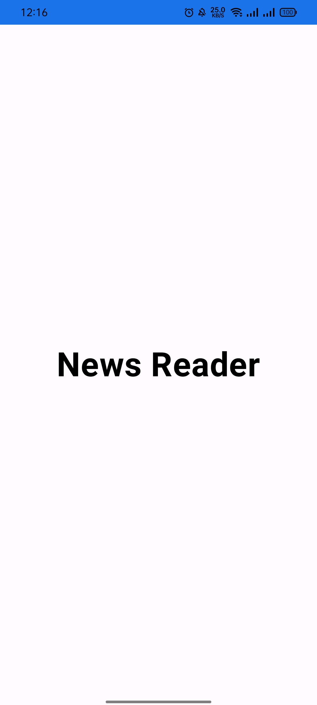
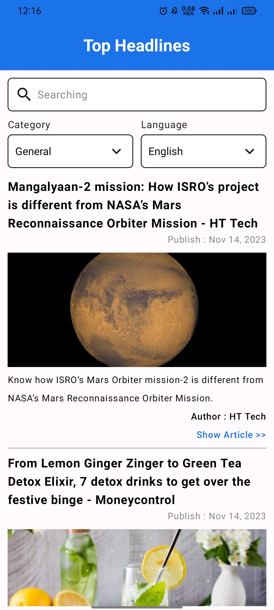
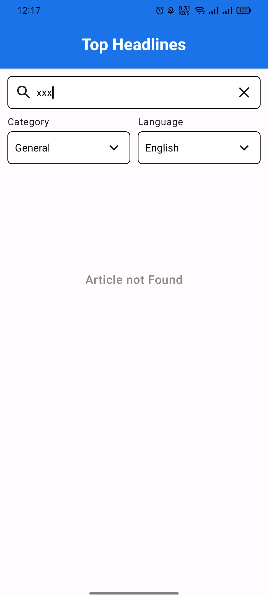
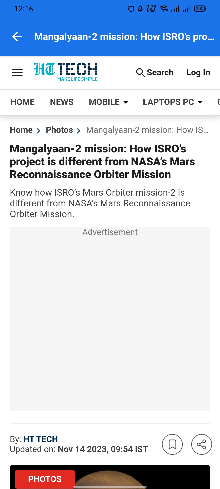

## Tentang Aplikasi

News Reader adalah aplikasi android untuk baca berita online menggunakan public api source dari <a href = "https://newsapi.org/">News API</a>
Aplikasi ini di bangun menggunakan :  
- [x] Kotlin sebagai bahasa Pemrogaman Utama</a>
- [x] Jetpack Compose sebagai UI Layout</a>
- [x] Clean Architecture & MVVM</a>
- [x] Hilt untuk Dependency Injection </a>
- [x] Retrofit2 untuk networking dan konsumsi REST API</a>
- [x] Coil untuk ImageLoader</a>

Aplikasi ini memiliki beberapa Halaman :
- [x] Halaman Splash
- [x] Halaman Daftar Top Headline
- [x] Halaman Detail Berita

## Preview Aplikasi

